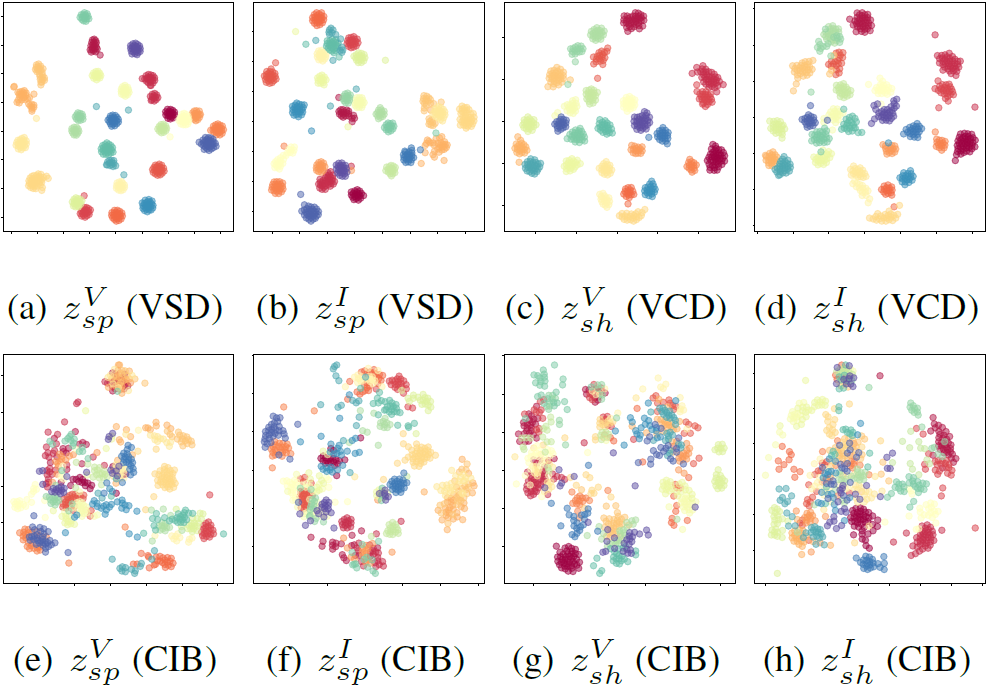

# Farewell to Mutual Information: Variational Distiilation for Cross-Modal Person Re-identification

Official implementation of the Variational Distillation framework from "Farewell to Mutual Information: Variational Distiilation for Cross-Modal Person Re-identification (CVPR' 21 oral)".

<div align=center>

</div>

Please read [our paper](https://arxiv.org/abs/2104.02862) for a more detailed description of the training procedure.

### Bibtex
Please use the following bibtex for citations:
```latex
@inproceedings{VariationalDistillation,
title={Farewell to Mutual Information Variational Distiilation for Cross-Modal Person Re-identification},
author={Xudong Tian and Zhizhong Zhang and Shaohui Lin and Yanyun Qu and Yuan Xie and Lizhuang Ma},
booktitle={Computer Vision and Pattern Recognition},
year={2021}
}
```

## Get Started
1. `cd` to folder where you want to download this project

2. Run `git clone https://github.com/FutabaSakuraXD/Farewell-to-Mutual-Information-Variational-Distiilation-for-Cross-Modal-Person-Re-identification.git`

3. Install dependencies:
    - python>=3.7.0
    - [pytorch>=1.3.0](https://pytorch.org/)
    - torchvision

4. Prepare datasets    
    - Download RegDB
    - Download [SYSU-MM01](https://github.com/wuancong/SYSU-MM01)

    Create a directory to store the required datasets under this project or outside this project, and remember to set `--data-dir` to the right path before training.

## Train
This project provides code to train and evaluate different architectures under both datasets. You can directly run `/mm01.py` and `regdb.py` under the default settings or conduct customized modifications for both datasets.

## Evaluation
   - MM01: To evaluate the model under standard protocol, you need to run `/feature_extract.py` to obtain features at first, then run `/evaluation/evaluation_SYSU_MM01.py` to conduct standard evaluation.
   - RegDB: You can directly run `/RegDB_test/RegDB_test.py` to obtain Visible-Thermal performance, and change the default settings to evaluate the model under another setting, i.e., Thermal-Visible.

## Results
SYSU-MM01 (all-search mode)
| Metric    | Value  |
| --- | --- |
| Rank1 | 60.02\% |
| Rank10 | 94.18\% |
| Rank20 | 98.14\% |
| mAP | 58.80\% |

SYSU-MM01 (indoor-search mode)
| Metric    | Value  |
| --- | --- |
| Rank1 | 66.05\% |
| Rank10 | 96.59\% |
| Rank20 | 99.38\% |
| mAP | 72.98\% |

RegDB
| Mode    | Rank-1 (mAP)  |
| --- | --- |
| Visible-Thermal | 73.2\% (71.6\%) |
| Thermal-Visible | 71.8\% (70.1\%) |

## Visualization
2-D projection of the embedding space obtained by using t-SNE. The results are obtained from our method and the conventional information bottleneck on SYSU-MM01 dataset. Different colors are used to denote different person IDs.

<div align=center>

</div>

In addition, we plot the joint embedding space of data from different modals for better visualization. Note more descriptions and details could be found in [our paper](https://arxiv.org/abs/2104.02862).

<div align=center>

</div>
